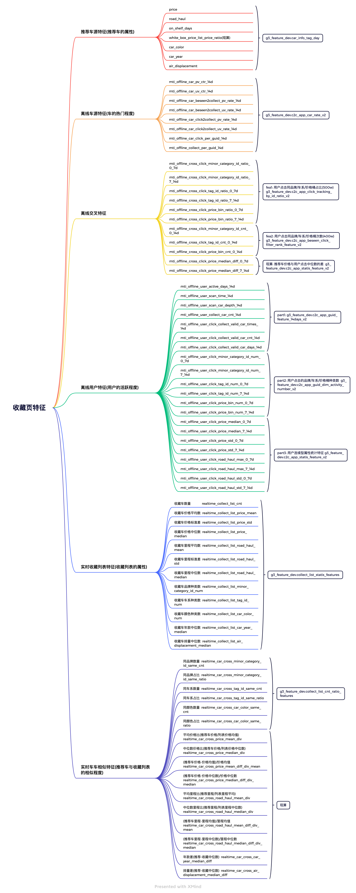

# 【2022-09-05】收藏页排序模型迭代
## 背景
- 目前收藏页底部推荐的线上排序模型是基于首页+无筛的数据训练的，且并未使用该模块特有的上下文特征-收藏列表
- 如使用本场景产生的数据与特有特征训练的排序模型能获得收益，则可在各场景推广该模式进行模型迭代
- 综上，有必要对该模型训练模式进行探索

## 结论
- 关键指标click_pv实验组相对提升6.65%，显著(p_value=8.7E-14)，collect_pv相对提升21.05%，显著(p_value=1.3E-19)
- 实验符合转全条件，其他佐证指标也没有明显问题，计划推全

## 样本
- 场景：收藏页底部推荐
- 样本：曝光且点击为正，曝光未点击为负
  - 迭代次数：100
样本选取逻辑
- 全局采样(正负样本比约1:5)
  - 曝光且点击为正样本
  - 曝光未点击随机取22%作为负样本
- 按请求采样(正负样本比约1:5)
  - 对有点击的query
    - 曝光且点击为正样本
    - score = int(rand()*100) - 2*mti_pos，取分数前5的曝光未点击作为负样本(靠前的曝光更容易被选到)
  - 对无点击的query
    - 以3/10的几率选择负样本，且过滤掉mti_pos <= 3的样本(差不多一半)

## 特征

## 总结反思
- 先基于简单采样生成的数据，不加任何trick出一个最简单的base，不能一日千里
- 模型迭代总共分为三部分：样本选取、特征选取、模型训练
- 训练集的生成要解耦，分为三元组标识符、特征落表、join样本生成三步走
- 定期review，防止一条路走到黑，及时检查调整，本次迭代总计出现三次大型返工
  - 1.选取neg_sample时没有规定is_click=1结果变成了所有样本随机选取
  - 2.由于最开始接触时收藏页在进行ab实验，为了与以后的数据分布更接近，我自作聪明的设置了ab_group=<实验组C>。结果8.25日之后推全导致ab_group=A，使得收藏列表特征出现大量缺失
  - 3.加入去冲突时对测试集也进行去冲突操作
- 数据校验意识
  - 使用join时要注意是否左右表中含重复数据
  - 特征落表后观察各列特征空值率是否异常
- 模型上线相关
  - 新增特征取名字
    - 直接取的: 保持和模型入参一致
    - 交叉特征: 把模型特征名去掉cross
