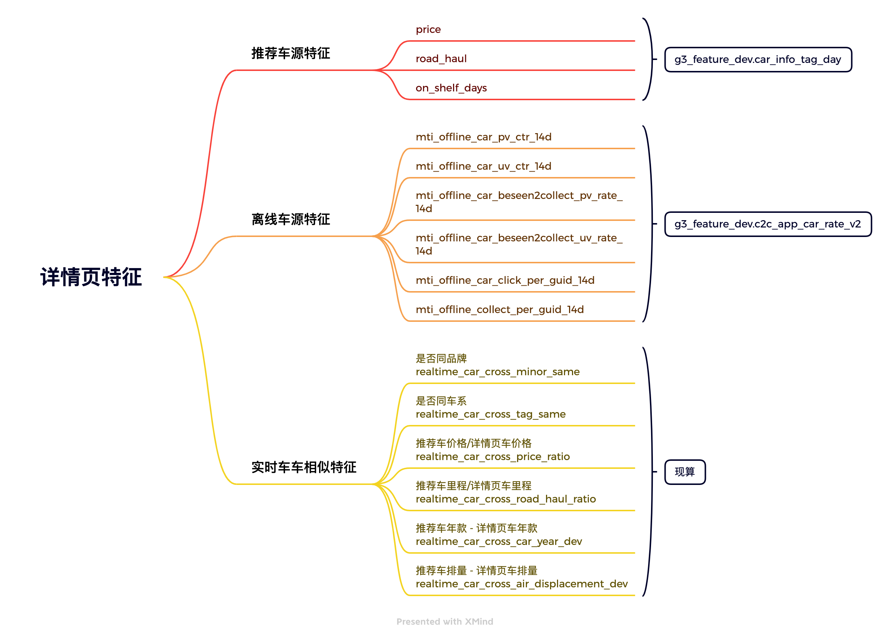
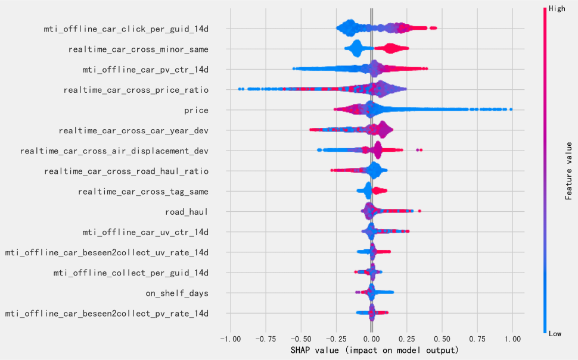

# 【2022-09-15】基于mti特征的详情页排序模型迭代
## 背景
- 公司数据埋点调整，eventid埋点即将下线；
- 原排序模型是基于eventid埋点特征训练的，由于发现部分页面eventid埋点不上报了，出现特征不一致问题，所以特征计算方式改为mti，但模型没变；
- 基于此，急需迭代一版基于mti特征的排序模型

## 结论
### 1.50流量(50%实验组(D)，50%对照组(B))
- 在详情页非有效供给场景下(c2c_car2car_detail)，实验组关键指标click_pv相对提升30.09%，显著(p_value=3.8E-12)，其他指标(click_uv、ctr、人均点击次数等)均有不同程度的提升
- 实验组过程指标收藏pv、咨询pv分别相对提升36.72%、27.13%，显著
- 于2022-10-18在有效供给&非有效供给两场景推全

  

### 2.小流量(20%实验组(D)，80%对照组(B))
- 实验组核心指标click_pv相对提升29.61%，显著，其他指标也均有显著提升
- 于2022-10-08放量至50

## 样本
- 场景：详情页更多二手车模块
- 样本：曝光且点击为正，曝光未点击为负
  - 迭代次数：100
样本选取逻辑
- 曝光且点击为正样本
- 曝光未点击随机取15%作为负样本

## 特征

## 模型训练与评估
| id  | 模型介绍 | 训练集AUC |	验证集AUC | 测试集AUC | GAUC(测试集为全量数据) | 说明 |
|:---:|:---:|:---:|:---:|:---:|:---:|:---:|
| 1 | 老模型 |  | | 0.532 | 0.499 | c2c_car_cross_car_lgb_rank_model   模型版本: 20220325 |
| 2 | base | 0.647 | 0.630 | 0.632 | 0.622 | 	场景: 更多二手车，采样: 简单采样，特征: 沿用上一版本的特征，去掉了线索与严选相关特征(dim=16)，参数: lr=0.1, num_rounds=100 | 
| 3 | +采样 | 0.640 | 0.622 | 0.631 | 0.622 | 采样: 分有点击&无点击的请求采样 | 
| 4 | +去冲突 | 0.642 | 0.632 | 0.633 | 0.623 | 去冲突: 去掉一天内同正同负的负样本 |
| 5 | +增加训练集天数 | 0.641 | 0.632 | 0.633 | 0.622 | 增加训练集天数: 增加5天训练集数据 |
| 6 | +去冲突+增加训练集天数 | 0.642 | 0.632 | 0.633 | 0.623 |
| 7 | id=6+fillna(0) | 0.642 | 0.632 | 0.633 | 0.622 | 为工程实现方便将缺失值补成0 |

## shap图

## 总结反思
- 尽量不要改前一版的特征名，不然上线的时候很容易出错
- 数据校验尽量别取最前面的几个车(有些diff特征是0容易看不出问题)
- 离线auc也就图一乐，跟线上auc差很远
